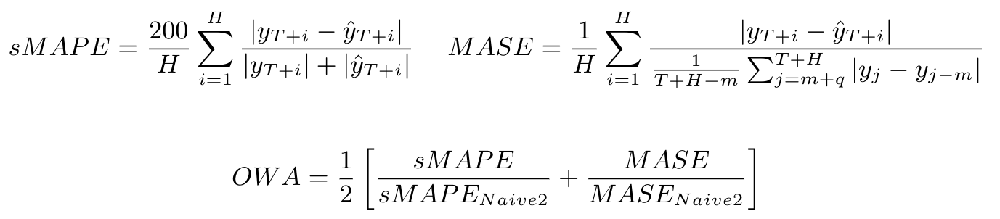

[](https://github.com/kdgutier/esrnn_torch/tree/pip)
[](https://pypi.python.org/pypi/ESRNN/)
[](https://pepy.tech/project/esrnn)
[](https://www.python.org/downloads/release/python-360+/)
[](https://github.com/kdgutier/esrnn_torch/blob/master/LICENSE)


# Pytorch Implementation of the ES-RNN
In this project we coded a pytorch class for the ES-RNN algorithm proposed by Smyl, winning submission of the M4 Forecasting Competition. The class wraps fit and predict methods to facilitate interaction with Machine Learning pipelines along with evaluation and data wrangling utility.

## Installation Prerequisites
* numpy==1.16.1
* pandas==0.25.2
* pytorch>=1.3.1

## Installation

This code is a work in progress, any contributions or issues are welcome on
GitHub at: https://github.com/kdgutier/esrnn_torch

You can install the *released version* of `ESRNN` from the [Python package index](https://pypi.org) with:

```python
pip install ESRNN
```

## Usage Example
Make sure on use of the model that the dataframes to fit satisfy being **balanced**,
and there are **no zeros** at the beginning of the series, there are  **no negative values**, since that
has bad interactions with the multiplicative model.

```python
from ESRNN.m4_data import prepare_m4_data
from ESRNN.utils_evaluation import evaluate_prediction_owa

from ESRNN import ESRNN

X_train_df, y_train_df, X_test_df, y_test_df = prepare_m4_data(dataset_name='Yearly',
                                                               directory = './data',
                                                               num_obs=1000)

# Instantiate model
model = ESRNN(max_epochs=25, freq_of_test=5, batch_size=4, learning_rate=1e-4,
              per_series_lr_multip=0.8, lr_scheduler_step_size=10,
              lr_decay=0.1, gradient_clipping_threshold=50,
              rnn_weight_decay=0.0, level_variability_penalty=100,
              testing_percentile=50, training_percentile=50,
              ensemble=False, max_periods=25, seasonality=[],
              input_size=4, output_size=6,
              cell_type='LSTM', state_hsize=40,
              dilations=[[1], [6]], add_nl_layer=False,
              random_seed=1, device='cpu')

# Fit model
# If y_test_df is provided the model
# will evaluate predictions on
# this set every freq_test epochs
model.fit(X_train_df, y_train_df, X_test_df, y_test_df)

# Predict on test set
y_hat_df = model.predict(X_test_df)

# Evaluate predictions
final_owa, final_mase, final_smape = evaluate_prediction_owa(y_hat_df, y_train_df,
                                                             X_test_df, y_test_df,
                                                             naive2_seasonality=1)
```
## Overall Weighted Average

A metric that is useful for quantifying the aggregate error of a specific model for various time series is the Overall Weighted Average (OWA) proposed for the M4 competition. This metric is calculated by obtaining the average of the symmetric mean absolute percentage error (sMAPE) and the mean absolute scaled error (MASE) for all the time series of the model and also calculating it for the Naive2 predictions. Both sMAPE and MASE are scale independent. These measurements are calculated as follows:




## Current Results
Here we used the model directly to compare to the original implementation. It is worth noticing that these results do not include the ensemble methods mentioned in the [ESRNN paper](https://www.sciencedirect.com/science/article/pii/S0169207019301153).<br/>
[Results of the M4 competition](https://www.researchgate.net/publication/325901666_The_M4_Competition_Results_findings_conclusion_and_way_forward).
<br/>

| DATASET   | OUR OWA | M4 OWA (Smyl) |
|-----------|:---------:|:--------:|
| Yearly    | 0.785   | 0.778  |
| Quarterly | 0.879   | 0.847  |
| Monthly   | 0.872   | 0.836  |
| Hourly    | 0.615   | 0.920  |
| Weekly    | 0.952   | 0.920  |
| Daily     | 0.968   | 0.920  |


## Replicating M4 results


Replicating the M4 results is as easy as running the following line of code (for each frequency) after installing the package via pip:

```console
python -m ESRNN.m4_run --dataset 'Yearly' --results_directory '/some/path' \
                       --gpu_id 0 --use_cpu 0
```

Use `--help` to get the description of each argument:

```console
python -m ESRNN.m4_run --help
```

## Authors
* **Kin Gutierrez** - [kdgutier](https://github.com/kdgutier)
* **Cristian Challu** - [cristianchallu](https://github.com/cristianchallu)
* **Federico Garza** - [FedericoGarza](https://github.com/FedericoGarza)

## License
This project is licensed under the MIT License - see the [LICENSE](https://github.com/kdgutier/esrnn_torch/blob/master/LICENSE) file for details.


## REFERENCES
1. [A hybrid method of exponential smoothing and recurrent neural networks for time series forecasting](https://www.sciencedirect.com/science/article/pii/S0169207019301153)
2. [The M4 Competition: Results, findings, conclusion and way forward](https://www.researchgate.net/publication/325901666_The_M4_Competition_Results_findings_conclusion_and_way_forward)
3. [M4 Competition Data](https://github.com/M4Competition/M4-methods/tree/master/Dataset)
4. [Dilated Recurrent Neural Networks](https://papers.nips.cc/paper/6613-dilated-recurrent-neural-networks.pdf)
5. [Residual LSTM: Design of a Deep Recurrent Architecture for Distant Speech Recognition](https://arxiv.org/abs/1701.03360)
6. [A Dual-Stage Attention-Based recurrent neural network for time series prediction](https://arxiv.org/abs/1704.02971)
