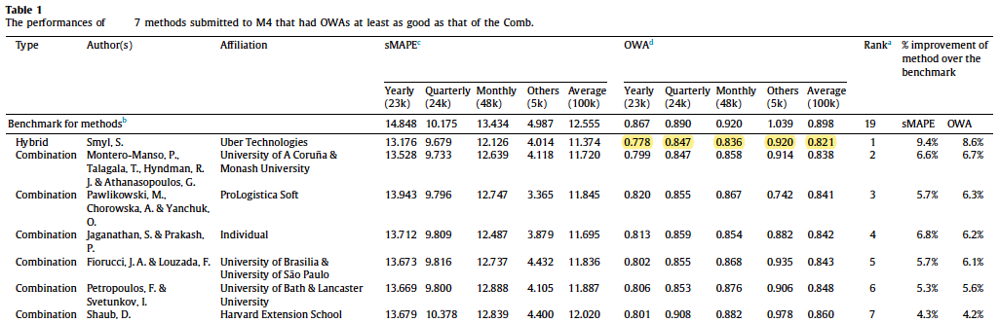

# Pytorch Implementation of the ES-RNN
Repository with a pytorch implementation of the ES-RNN algorithm proposed by Smyl at the M4 Competition. [Results of the M4 competition](https://www.researchgate.net/publication/325901666_The_M4_Competition_Results_findings_conclusion_and_way_forward).

<p float="center">
  
</p>

## Conda Environment
```console
local_user@local_host$ bash setup.sh
```

## Experiment Configuration Files
Configuration fles at configs/config_m4yearly.yaml

# Run original ESRNN
```console
local_user@local_host$ conda activate esrnn_torch
local_user@local_host$ jupyter notebook m4_test.ipynb
local_user@local_host$ PYTHONPATH=. python src/M4_experiment.py --model_id 0
local_user@local_host$ PYTHONPATH=. python src/hyperpar_tunning_m4.py --id_min 0 --id_max 1 --dataset 'Quarterly' --gpu_id (optional)
```

## Authors


## License
This project is licensed under the MIT License - see the [LICENSE](https://github.com/kdgutier/esrnn_torch/LICENSE) file for details.

# Run original ESRNN
```console
local_user@local_host$ conda activate esrnn_torch
local_user@local_host$ jupyter notebook m4_test.ipynb
local_user@local_host$ PYTHONPATH=. python src/M4_experiment.py --model_id 0
local_user@local_host$ PYTHONPATH=. python src/hyperpar_tunning_m4.py --id_min 0 --id_max 1 --dataset 'Quarterly' --gpu_id (optional)
```

## REFERENCES
1. [A hybrid method of exponential smoothing and recurrent neural networks for time series forecasting](https://www.sciencedirect.com/science/article/pii/S0169207019301153)
2. [The M4 Competition: Results, findings, conclusion and way forward](https://www.researchgate.net/publication/325901666_The_M4_Competition_Results_findings_conclusion_and_way_forward)
3. [M4 Data](https://github.com/M4Competition/M4-methods/tree/master/Dataset)
4. [Dilated Recurrent Neural Networks](https://papers.nips.cc/paper/6613-dilated-recurrent-neural-networks.pdf)
5. [Residual LSTM: Design of a Deep Recurrent Architecture for Distant Speech Recognition](https://arxiv.org/abs/1701.03360)
6. [A Dual-Stage Attention-Based recurrent neural network for time series prediction](https://arxiv.org/abs/1704.02971)
